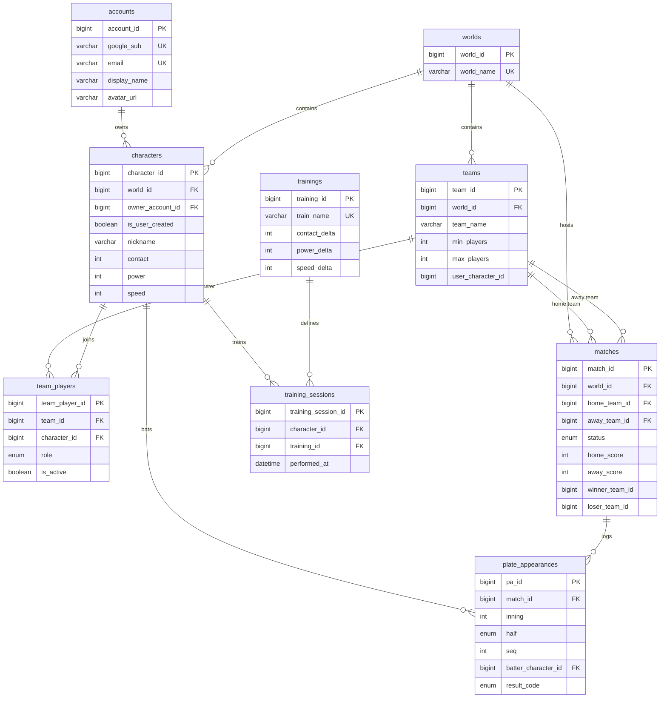

# 모노레포 프로젝트 (Monorepo Project)

이 프로젝트는 Next.js 웹 애플리케이션과 FastAPI 백엔드(MariaDB 포함)를 포함하는 모노레포입니다.

## 폴더 구조 (Structure)

```
repo/
  apps/
    api/    # FastAPI 백엔드
    web/    # Next.js 프론트엔드
  infra/    # 인프라 (Docker, Database)
```

## 시작하기 (Getting Started)

이 프로젝트를 로컬 환경에서 설정하고 실행하는 방법입니다.

### 사전 요구사항 (Prerequisites)

- [Docker & Docker Compose](https://www.docker.com/products/docker-desktop/)
- [Node.js](https://nodejs.org/) (v18 이상)

### 환경 설정 (Environment Setup)

이 프로젝트에는 간편한 설정을 위해 환경 변수 기본값이 플레이스홀더로 지정되어 있습니다.

1.  보안이 필요한 경우 `.env.example`을 복사하여 `.env`를 만드세요 (로컬 개발 시 선택 사항).

### Docker로 실행하기 (백엔드 권장)

데이터베이스와 API는 Docker를 사용하여 실행하고, 웹 앱은 로컬에서 실행하면 더 빠른 개발 피드백을 받을 수 있습니다.

1.  **인프라 시작**:

    ```bash
    cd infra
    docker-compose up --build
    ```

    _(만약 `docker-compose` 명령어가 없으면 `docker compose`를 시도해보세요)_

2.  **웹 앱 시작**:
    새 터미널을 열고 다음을 실행하세요:
    ```bash
    cd apps/web
    npm install
    npm run dev
    ```
    [http://localhost:3000](http://localhost:3000)에서 웹 앱에 접속할 수 있습니다.

### 문제 해결 (Troubleshooting)

- **`winner_team_id` 오류**: 스키마 수정으로 해결되었습니다. 만약 DB 오류가 계속되면 `docker-compose down -v`를 실행하여 볼륨을 초기화하세요.
- **`docker-credential-desktop` 오류**: `~/.docker/config.json` 파일을 열고 `credsStore` 항목을 삭제하세요.

## 데이터베이스 스키마 (Database Schema)


