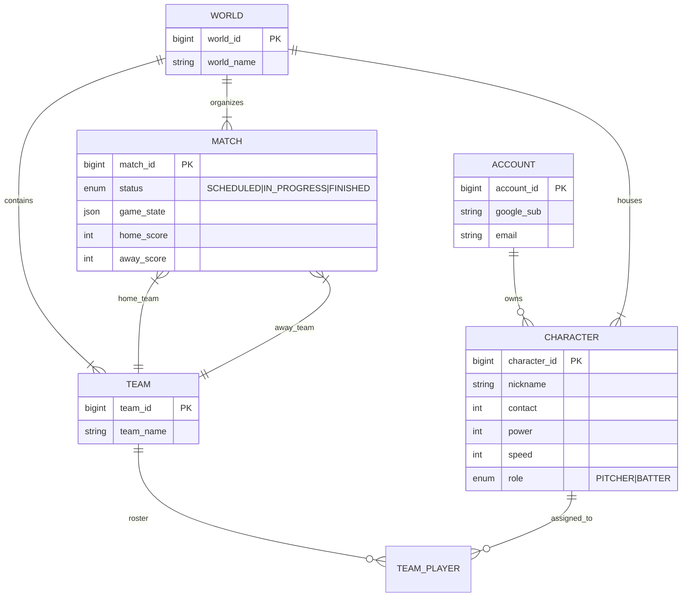
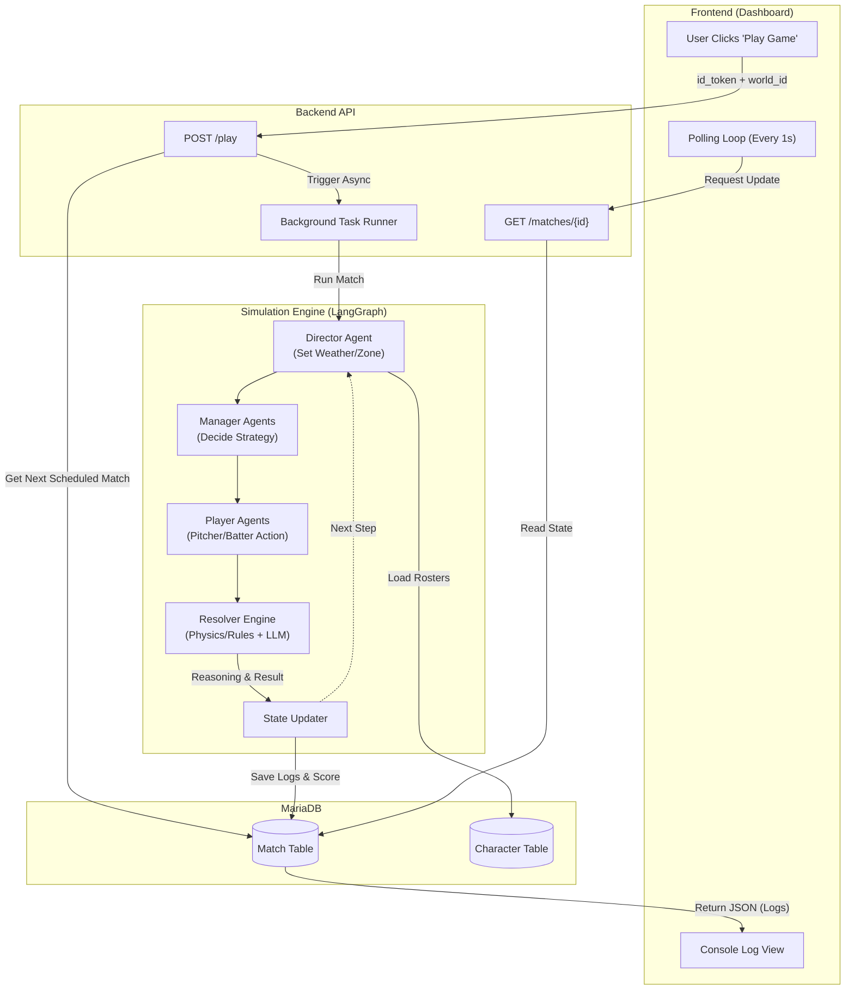

# System Architecture & Diagrams

Here are the UML diagrams representing the key features of the Agentic Baseball Simulator.

## 1. User Onboarding & League Initialization Flow

This sequence diagram illustrates the flow from User Login to the automatic generation of the Baseball League (World, Teams, Matches).

```mermaid
sequenceDiagram
    actor User
    participant Web as Frontend (Next.js)
    participant API as Backend API (FastAPI)
    participant Auth as Auth Module
    participant Service as League Service
    participant DB as MariaDB

    %% Authentication
    User->>Web: Login with Google
    Web->>API: GET /me (id_token)
    API->>Auth: Verify Token
    Auth-->>API: Valid Payload
    API->>DB: Upsert Account
    DB-->>API: Account ID
    API-->>Web: User Profile

    %% Character Creation
    User->>Web: Fill Character Form & Submit
    Web->>API: POST /characters
    API->>DB: Create Character
    DB-->>API: Character Created
    API-->>Web: Character Object

    %% Auto-Initialization
    Note over Web, Service: Triggered automatically after creation
    Web->>API: POST /league/init
    API->>Service: generate_league(user_char_id)

    rect rgb(30, 30, 40)
        note right of Service: World Generation Logic
        Service->>DB: Create unique "World"
        Service->>DB: Generate 4 Teams (Seoul, Busan, etc.)
        Service->>DB: Generate 35+ NPC Characters
        Service->>DB: Assign User to Team 1
        Service->>DB: Generate Round-Robin Schedule (Matches)
    end

    Service-->>API: Success Stats (Teams, Matches count)
    API-->>Web: 200 OK
    Web->>User: Redirect to Dashboard
```

## 2. Database Schema (Entity Relationship)

This ER diagram shows the relationships between the core entities.

## 3. Simulation & Gameplay Architecture

This flowchart demonstrates how the "Play Game" feature works, connecting the Frontend, Backend, and the AI Simulation Engine.

